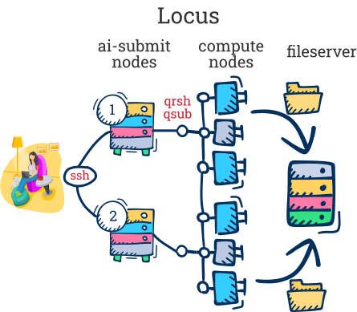

# Locus

- [Overview](#overview)
- [Login via ssh](#login-via-ssh)
- [Interactive session](#interactive-session)
- [Access folders](#access-folders)
- [Basic unix commands](#basic-unix-commands)
- [Batch job](#batch-job)
- [More information for the curious](#more-information-for-the-curious)

## Overview

[Locus website](https://locus.niaid.nih.gov) - if you don't have a Locus server account, the first time you log into the website (using your regular NIH creds), you will get an email telling you how to request an account.  Can also email [NIAIDHPCSUPPORT@niaid.nih.gov](mailto:NIAIDHPCSUPPORT@niaid.nih.gov).  Locus is intended for use by NIAID staff.

### Why do you need HPC?

Locus is a *H*igh *P*erformance *C*omputing cluster. Why do you need it?

- You need resources (software, power) not available on your local laptop
- You need to run a program (job) that will run for a very long time
- You need to run a job that can make use of parallel computing




## Login via ssh

- Need a command line shell program:
  - Mac users can ssh with Terminal (Applications -> Utilities).  
  - Windows users with Windows 10 and above can use PowerShell, but it may not work very well.  Some alternatives are [git-bash](https://gitforwindows.org), [PuTTY](http://www.chiark.greenend.org.uk/~sgtatham/putty/download.html), [MobaXterm](https://mobaxterm.mobatek.net/), [Cygwin](http://www.cygwin.com/), or [WinSCP](https://winscp.net/eng/index.php).
- Connect to NIH network/VPN.
- From the command line:


```bash
ssh username@ai-submit2.niaid.nih.gov
## enter password
```

## Interactive session

- To do work on Locus, open an interactive session:

```bash
qrsh -l h_vmem=16G
```
- `h_vmem` is the maximum amount of memory you will be allowed to use.  You should set this parameter based on how big the files are that you will be working with - here using 16 gigabytes.

## Access folders

### Mount folders to laptop

**Home directory**

- **Mac**: in Finder, Cmd+K smb://locusfileserver.niaid.nih.gov/username
- **Windows**: \\\locusfileserver.niaid.nih.gov\username

**Other folders on Locus:** `/hpcdata/rest/of/path`.  When you mount, replace `/hpcdata/` :

- **Mac:** smb://locusfileserver.niaid.nih.gov/rest/of/path
- **Windows:** \\\locusfileserver.niaid.nih.gov\\rest\\of\\path

### Access folders via sftp

- alternate way to access folders if mounting doesn't work

- [Cyberduck](https://cyberduck.io/) -> Open Connection (icon top left of the window) 


## Basic unix commands

- [Cheat sheet](https://web.stanford.edu/class/physics91SI/handouts/04_UNIX_Commands.pdf); [Longer cheat sheet](http://www.mathcs.emory.edu/~valerie/courses/fall10/155/resources/unix_cheatsheet.html)

```bash
## list files in directory
ls
## long (more info) format with human readable file sizes
ls -lh
## folder sizes in the current working directory
du -sh .

## get the path to your current directory
pwd

## change to another directory (replace directoryname with name of directory)
cd directoryname

## change to the directory above
cd ..
## change to your home directory
cd

## copy a file
cp file path/to/new/location
# copy a directory
cp -r directory newdirectory
# copy file to the directory you are currently in. '.' is shortcut for current directory
cp file .

## move a file
mv file path/to/new/location

## make a new directory
mkdir newdirectory

## look at a file (replace filename)
less filename
## to quit less - type `q`

## get help - replace command with the command/program you need help with
man command
command -h | less

## print the content of a file to the screen
cat file

## delete files - CAUTION!  There is no recycling bin.  Files removed are gone forever (well, technically, Locus makes backups, but only once a day)
rm file
rm -r directory
```


### Locus-specific commands

- also see batch job section below and [more on modules](https://locus.niaid.nih.gov/userportal/documentation.php#Getting-Started/Modules).

```bash
## load module - replace modulename with the program (e.g. fastqc)
module load modulename
## unload one module
module unload modulename
## unload all modules (in case you get an error when you load one)
module purge; module load uge
# uge allows qsub and qrsh to run - always load after purging

## list all loaded modules
module list
## search for module versions
module avail modulename
## get info on module
module info modulename

## close your interactive session or log out of locus
exit
```


## Batch Job

- [Locus documentation](https://locus.niaid.nih.gov/userportal/documentation.php#Getting-Started/Submitting-your-First-Job)
- Alternative to [interactive session](#interactive-session) - run a script of commands in a *batch job* - after submit job, can close laptop and walk away while it runs on Locus.  Emails you when done.
- [job_submit.sh](job_submit.sh) - Create/edit script on laptop using *plain text* editor like TextEdit or Notepad or *programming* editor like [Atom](https://atom.io/) or [VSCode](https://code.visualstudio.com/) and transfer by [mounting Locus folder](#access-folders).  (*don't use a document editor like Word to edit scripts*)
- Submit job

  ```bash
  qsub job_submit.sh
  ```
- Check on job while running

  ```bash
  qstat -u username
  qstat -j jobid
  ## filter for just usage info
  qstat -j jobid | grep usage
  ```

- Get info about job after it's done running

  ```bash
  qacct -j jobid
  ## all jobs run by you in the last 2 days
  qacct -u username -d 2 -j | less
  ```

- Delete a runing job that you don't need it anymore
  ```bash
  qdel jobid
  ```

- Check the running processes on the current node
  ```bash
  htop
  ```


## More information for the curious

- [Locus website](https://locus.niaid.nih.gov) has more detailed information on commands and usage.
- **Under the hood:** Operating system is RedHatEnterpriseServer (related to CentOS and Fedora)
  - For job scheduling system, Locus uses [Univa Grid Engine (UGE)](http://www.univa.com/products/) - [older man pages](https://www.gridengine.eu/mangridengine/manuals.html) - formerly SGE/Sun Grid Engine.
    - [Biowulf](https://hpc.nih.gov), NIH's agency-wide cluster, uses a system called Slurm, so the commands may not be the same

### Advanced usage

- [advanced_job_submit.sh](advanced_job_submit.sh) - example script with more options for qsub allowing finer control of the job and output
- For more on interactive qrsh and qsub: [qrsh tutorial](https://locus.niaid.nih.gov/userportal/documentation.php#Getting-Started/Other-Job-Types/Interactive).  [Other qrsh/qsub options](https://locus.niaid.nih.gov/userportal/documentation.php#Getting-Started/HPC-Basics) - halfway down page; especially for [parallel processing](https://locus.niaid.nih.gov/userportal/documentation.php#Getting-Started/Other-Job-Types/Parallel).

- For mac, to run GUI applications on Locus, need [XQuartz](https://www.xquartz.org/).  Needs admin permissions to install; email NIAID IT, and they can install for you.

- make a new text file and edit it directly in the command line shell on Locus with [nano](https://www.linode.com/docs/tools-reference/tools/use-nano-text-editor-commands/#create-and-open-files)

  ```bash
  nano file
  ```


### Copy folders from Locus to Laptop via command line

```bash
## example command: replace username with your username!
scp -r username@ai-submit2.niaid.nih.gov:/classhome/username ~/Desktop

## basic command structure
## `-r` means "recursive" so we copy the folder and everything in it.
scp -r fromfoldername tofoldername

## general command
scp -r username@servername:serverfolderpath laptopfolderpath
 
## You could also use rsync
rsync -r username@ai-submit2.niaid.nih.gov:/classhome/username ~/Desktop/myfolder
```


### JupyterHub hosted by Locus

- JupyterHub is a way to interact with Locus through a browser.  It is based on the popular [Jupyter notebooks](https://www.nature.com/articles/d41586-018-07196-1).

- https://ai-submit2.niaid.nih.gov:10101/
- Some tips:

To install python packages, you need to login to Locus and qrsh to a node.

```bash
module load Anaconda3/5.3.0
source activate /sysapps/cluster/software/Anaconda3/5.3.0/envs/jupyterenv
pip install --user myPackage
```

Then the package will be available to your jupyterhub. 


To install packages to the R kernel (3.6.1) on Jupyter Hub, however, you have to call for the module-Anaconda2/5.3.0

```bash
module load Anaconda2/5.3.
install.packages("package_name")
## or for bioconductor
BiocManager::install("package_name")
```

### Limitations and being a good citizen

Locus is a **shared resource**.  While it is very large and powerful, there are still only a finite number of cpus/job slots and a finite amount of memory.

- You cannot run jobs on the login/submit/head nodes.  Do **NOT** run computational or memory-intensive tasks on the head nodes!  It slows them down for your colleagues.
- Be conscious of [the number of job slots and amount of memory](https://locus.niaid.nih.gov/userportal/workload2.php) you are using at any one time.  Locus has some limits, but they are pretty generous.  If you think you will be using resources close to the limit for days at a time or you need more, contact Locus staff. 
- Learn how to submit [array jobs](https://locus.niaid.nih.gov/userportal/documentation.php#Getting-Started/Other-Job-Types/Array) and how to limit them (`-tc` is array job limit flag).  
  - Alternatively, learn a pipeline framework like [snakemake](https://snakemake.readthedocs.io/en/stable/) or [nextflow](https://www.nextflow.io) which automatically submit jobs based on your pipeline and number of inputs, and have easy options for limiting (efficiently!).  They are especially efficient for multi-step workflows.

**Other limitations**

- If you want to run Rstudio on Locus, the best way is to use the NoMachine Virtue Machine, to do that you need to get a LDAP account and set up a connection following instruction [here](https://locus.niaid.nih.gov/userportal/documentation.php#FAQ/the-nomachine-terminal-server). 
- Interactive 3D ploting using the "rgl" package is not possible because a OpenGL library is lacking on Locus.  


